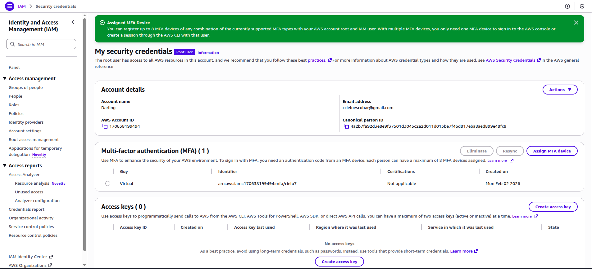
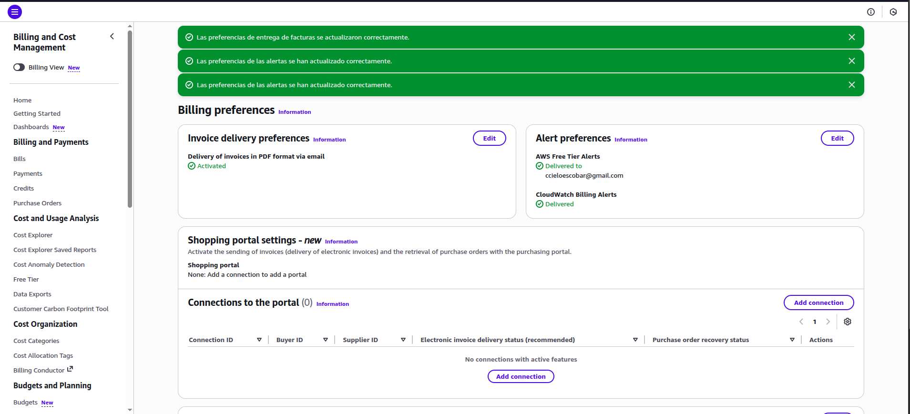
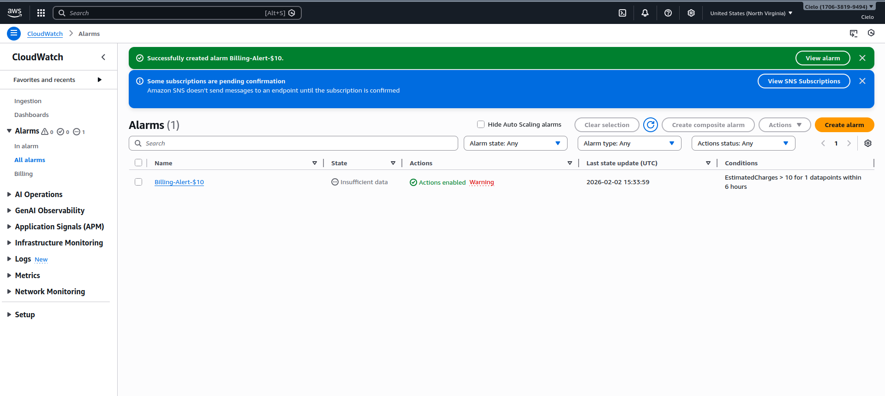
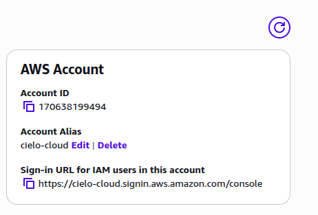
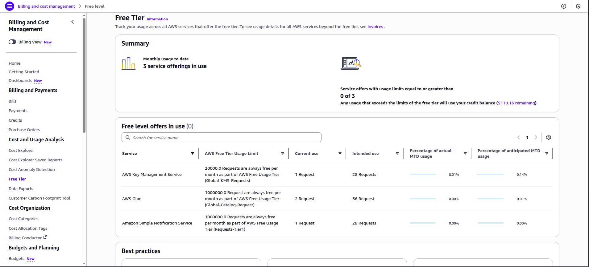

# AWS Account Setup Lab - Solution

**Student Name:** [Your Name]  
**Date Completed:** [Date]

---

## Exercise 1: MFA Configuration

### Screenshot:

### Notes:
- Authenticator app used: [Google Authenticator / Microsoft Authenticator / Authy]
- MFA setup completed successfully: [Yes / No]
- Backup codes saved: [Yes / No]

---

## Exercise 2: Billing Alerts

### Screenshots:

**Billing Preferences:**

**Billing Alarm:**

**SNS Confirmation:**

### Configuration Details:
- Alert threshold: $[amount]
- Email confirmed: [Yes / No]
- Additional thresholds created (bonus): [Yes / No - if yes, list amounts]

---

## Exercise 3: Account Alias

### Screenshot:

### Account Details:
- **Account Alias:** [your-alias-here]
- **Sign-In URL:** `https://[your-alias].signin.aws.amazon.com/console`
- **Tested successfully:** [Yes / No]

---

## Exercise 4: Free Tier Dashboard

### Screenshot:

### Current Free Tier Usage Summary:

| Service | Current Usage | Free Tier Limit | Status |
|---------|--------------|-----------------|--------|
| EC2 | [X hours / 750 hours] | 750 hours/month | [Green/Yellow/Red] |
| S3 | [X GB / 5 GB] | 5 GB | [Green/Yellow/Red] |
| [Other services...] | | | |

### Notes:
- Any services approaching limits? [Yes / No - if yes, which ones?]
- Any unexpected usage? [Yes / No - if yes, describe]

---

## Exercise 5: Reflection Questions

### 1. Why is MFA important even for a personal learning account?

**Your Answer:**
[Write your answer here. Consider: What could happen if someone gained access to your account? What damage could they do? What costs could they incur?]

---

### 2. What would happen if you left your root user unprotected?

**Your Answer:**
[Write your answer here. Think about: What access does root user have? What could an attacker do? How would you recover?]

---

### 3. How do billing alerts help prevent unexpected charges?

**Your Answer:**
[Write your answer here. Consider: When do you get notified? What actions can you take? Why is proactive monitoring important?]

---

### 4. What threshold did you set for your billing alert and why?

**Your Answer:**
[Write your answer here. Explain: Why did you choose this amount? Is it appropriate for your usage? Would you set multiple thresholds?]

---

### 5. What is your account alias and why did you choose it?

**Your Answer:**
- **Alias:** [your-alias]
- **Reasoning:** [Why did you choose this name? What makes it memorable and professional?]

---

### 6. What services are you currently using according to the Free Tier dashboard?

**Your Answer:**
[List the services you're using and their current usage levels. Are you surprised by any usage?]

---

## Bonus Challenges Completed (Optional)

### Challenge 1: Multiple Billing Alert Thresholds

- [ ] $5 threshold
- [ ] $25 threshold
- [ ] $50 threshold

**Screenshots (if completed):**
[Add screenshots here]

---

### Challenge 2: CloudTrail Enabled

- [ ] CloudTrail enabled
- [ ] Logging to S3 configured

**Notes:**
[Add any notes about CloudTrail setup]

---

### Challenge 3: AWS Trusted Advisor Reviewed

- [ ] Accessed Trusted Advisor
- [ ] Reviewed recommendations

**Key recommendations found:**
[List any recommendations you found]

---

## Lessons Learned

**What was the most challenging part of this lab?**

[Your answer]

---

**What would you do differently next time?**

[Your answer]

---

**What security practices will you implement going forward?**

[Your answer]

---

## Checklist Before Submission

- [ ] All required screenshots captured and saved
- [ ] Screenshots are clear and show relevant information
- [ ] All reflection questions answered thoroughly
- [ ] Account alias documented
- [ ] Free Tier usage documented
- [ ] Work committed to Git
- [ ] Pull request created
- [ ] PR URL submitted to Student Portal

---

**Lab Completed By:** [Your Name]  
**Date:** [Date]
